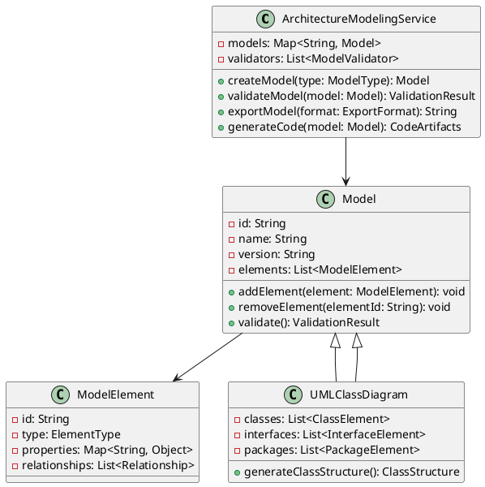
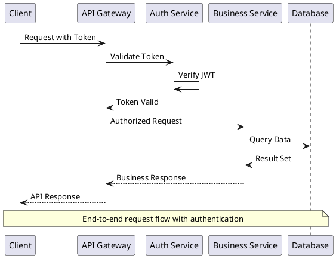
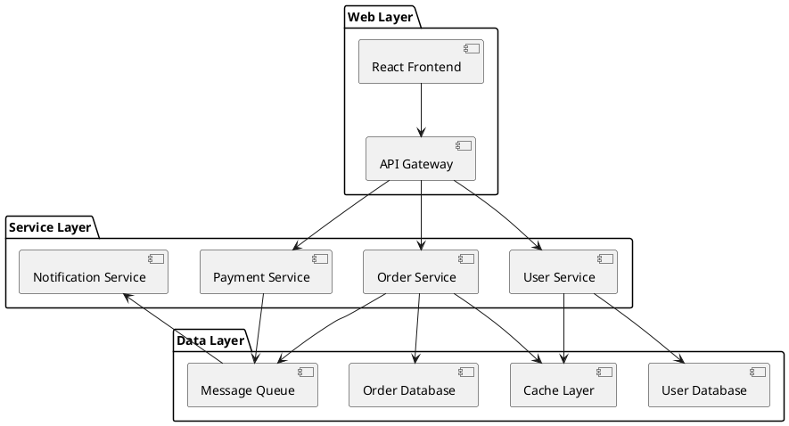
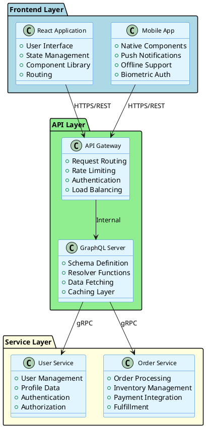

# Architecture Modeling Tools

## Modeling and Documentation

Modern architecture modeling requires sophisticated tools and methodologies to create clear, maintainable, and collaborative architectural documentation. This guide covers comprehensive tooling strategies, from visualization platforms to automated documentation generation systems.

### UML Diagrams

Unified Modeling Language remains a cornerstone for architecture visualization, providing standardized notation for complex system relationships.

#### Class Diagrams


#### Sequence Diagrams
Sequence diagrams capture temporal behavior and interaction patterns between system components:



#### Component Diagrams
Show high-level system organization and dependencies:



### C4 Model

The C4 model provides a hierarchical approach to software architecture documentation with four levels of abstraction.

#### Context Diagrams
System context showing external dependencies:

```python
# C4 Context Diagram Generator
class C4ContextDiagram:
    def __init__(self, system_name: str):
        self.system_name = system_name
        self.people = []
        self.systems = []
        self.relationships = []
    
    def add_person(self, name: str, description: str, external: bool = True):
        self.people.append({
            'name': name,
            'description': description,
            'external': external,
            'type': 'person'
        })
    
    def add_system(self, name: str, description: str, external: bool = True):
        self.systems.append({
            'name': name,
            'description': description,
            'external': external,
            'type': 'system'
        })
    
    def add_relationship(self, from_entity: str, to_entity: str, 
                        description: str, technology: str = None):
        self.relationships.append({
            'from': from_entity,
            'to': to_entity,
            'description': description,
            'technology': technology
        })
    
    def generate_plantuml(self) -> str:
        diagram = f"@startuml\n!include <C4/C4_Context>\nTitle {self.system_name} - Context Diagram\n\n"
        
        for person in self.people:
            if person['external']:
                diagram += f"Person_Ext({person['name']}, \"{person['description']}\")\n"
            else:
                diagram += f"Person({person['name']}, \"{person['description']}\")\n"
        
        for system in self.systems:
            if system['external']:
                diagram += f"System_Ext({system['name']}, \"{system['description']}\")\n"
            else:
                diagram += f"System({system['name']}, \"{system['description']}\")\n"
        
        diagram += "\n"
        for rel in self.relationships:
            tech = f", \"{rel['technology']}\"" if rel['technology'] else ""
            diagram += f"Rel({rel['from']}, {rel['to']}, \"{rel['description']}\"{tech})\n"
        
        diagram += "\n@enduml"
        return diagram
```

#### Container Diagrams
Show application structure and major technology choices:

```yaml
# Container diagram configuration
containers:
  web_application:
    name: "Web Application"
    technology: "React, TypeScript"
    description: "Provides user interface for e-commerce platform"
    responsibilities:
      - User authentication
      - Product browsing
      - Shopping cart management
      - Order placement
  
  api_application:
    name: "API Application"
    technology: "Node.js, Express"
    description: "Provides REST API for web and mobile clients"
    responsibilities:
      - Request routing
      - Business logic orchestration
      - Data validation
      - Response formatting
  
  database:
    name: "Database"
    technology: "PostgreSQL"
    description: "Stores user accounts, product catalog, orders"
    responsibilities:
      - Data persistence
      - Transaction management
      - Data integrity
      - Query optimization

relationships:
  - from: "Customer"
    to: "web_application"
    description: "Uses"
    technology: "HTTPS"
  
  - from: "web_application"
    to: "api_application"
    description: "Makes API calls to"
    technology: "JSON/HTTPS"
  
  - from: "api_application"
    to: "database"
    description: "Reads from and writes to"
    technology: "SQL/TCP"
```

### Architecture Tools

#### Enterprise Architect
Enterprise-grade modeling platform with comprehensive UML support:

```xml
<!-- Enterprise Architect model export configuration -->
<EAModelExport>
    <ExportSettings>
        <Format>XMI 2.1</Format>
        <IncludePackages>true</IncludePackages>
        <IncludeDiagrams>true</IncludeDiagrams>
        <IncludeElements>true</IncludeElements>
        <IncludeConnectors>true</IncludeConnectors>
        <IncludeTaggedValues>true</IncludeTaggedValues>
        <IncludeConstraints>true</IncludeConstraints>
        <IncludeRequirements>true</IncludeRequirements>
    </ExportSettings>
    <AutomationScripts>
        <Script name="ArchitectureValidation">
            <Language>JavaScript</Language>
            <Purpose>Validate architecture compliance</Purpose>
            <Triggers>
                <Trigger>BeforeSave</Trigger>
                <Trigger>BeforeGenerate</Trigger>
            </Triggers>
        </Script>
    </AutomationScripts>
</EAModelExport>
```

#### Lucidchart
Cloud-based collaborative diagramming with real-time editing:

```javascript
// Lucidchart API integration for automated diagram generation
class LucidchartIntegration {
    constructor(apiKey, userId) {
        this.apiKey = apiKey;
        this.userId = userId;
        this.baseUrl = 'https://api.lucidchart.com/1';
    }
    
    async createArchitectureDiagram(templateId, data) {
        const diagram = await this.createDocument(templateId);
        await this.populateFromData(diagram.id, data);
        return diagram;
    }
    
    async createDocument(templateId) {
        const response = await fetch(`${this.baseUrl}/documents`, {
            method: 'POST',
            headers: {
                'Authorization': `Bearer ${this.apiKey}`,
                'Content-Type': 'application/json'
            },
            body: JSON.stringify({
                title: 'Architecture Diagram',
                product: 'lucidchart',
                templateId: templateId
            })
        });
        return response.json();
    }
    
    async populateFromData(documentId, architectureData) {
        const updates = this.generateShapeUpdates(architectureData);
        
        for (const update of updates) {
            await fetch(`${this.baseUrl}/documents/${documentId}/shapes`, {
                method: 'POST',
                headers: {
                    'Authorization': `Bearer ${this.apiKey}`,
                    'Content-Type': 'application/json'
                },
                body: JSON.stringify(update)
            });
        }
    }
    
    generateShapeUpdates(data) {
        return data.components.map(component => ({
            class: 'Rectangle',
            text: component.name,
            style: {
                fill: component.type === 'service' ? '#e1f5fe' : '#f3e5f5',
                stroke: '#1976d2',
                strokeWidth: 2
            },
            position: component.position
        }));
    }
}
```

#### PlantUML
Text-based diagramming with version control integration:



### Documentation Platforms

#### Confluence Integration
Automated architecture documentation publishing:

```python
class ConfluencePublisher:
    def __init__(self, base_url, username, api_token):
        self.base_url = base_url
        self.auth = (username, api_token)
        self.session = requests.Session()
        self.session.auth = self.auth
    
    def publish_architecture_doc(self, space_key, parent_page_id, 
                                architecture_model):
        # Create main architecture page
        main_page = self.create_page(
            space_key,
            parent_page_id,
            "System Architecture Overview",
            self.generate_overview_content(architecture_model)
        )
        
        # Create sub-pages for each component
        for component in architecture_model.components:
            self.create_page(
                space_key,
                main_page['id'],
                f"{component.name} - Component Documentation",
                self.generate_component_content(component)
            )
        
        return main_page
    
    def generate_overview_content(self, model):
        content = f"""
        <h2>Architecture Overview</h2>
        <p>Last Updated: {datetime.now().strftime('%Y-%m-%d %H:%M:%S')}</p>
        
        <ac:structured-macro ac:name="plantuml">
            <ac:parameter ac:name="content">
                {model.generate_plantuml_overview()}
            </ac:parameter>
        </ac:structured-macro>
        
        <h3>System Components</h3>
        <table>
            <tr><th>Component</th><th>Type</th><th>Technology</th><th>Status</th></tr>
        """
        
        for component in model.components:
            content += f"""
            <tr>
                <td><a href="#component-{component.id}">{component.name}</a></td>
                <td>{component.type}</td>
                <td>{component.technology}</td>
                <td><span class="status-{component.status.lower()}">{component.status}</span></td>
            </tr>
            """
        
        content += "</table>"
        return content
```

#### GitBook Integration
Documentation as code with automated publishing:

```yaml
# .gitbook.yaml configuration
root: ./docs

structure:
  readme: ./README.md
  summary: ./SUMMARY.md

title: System Architecture Documentation
description: Comprehensive architecture documentation for our platform

plugins:
  - plantuml
  - mermaid
  - code-tabs
  - architecture-diagrams

variables:
  system_name: "E-commerce Platform"
  version: "2.0"
  last_updated: "2024-01-15"

integrations:
  github:
    enabled: true
    repo: "company/architecture-docs"
    branch: "main"
    sync_on_push: true
  
  jira:
    enabled: true
    project_key: "ARCH"
    link_requirements: true
```

### Collaborative Design

#### Design Workshops
Structured approach to collaborative architecture design:

```python
class ArchitectureWorkshop:
    def __init__(self, facilitator, participants, duration_hours=4):
        self.facilitator = facilitator
        self.participants = participants
        self.duration = duration_hours
        self.activities = []
        self.outcomes = []
    
    def run_event_storming_session(self, domain_scope):
        """Event Storming workshop for domain modeling"""
        session = EventStormingSession(domain_scope)
        
        # Phase 1: Orange stickies - Domain events
        events = session.capture_domain_events(self.participants)
        
        # Phase 2: Blue stickies - Commands
        commands = session.identify_commands(events)
        
        # Phase 3: Yellow stickies - Aggregates
        aggregates = session.define_aggregates(events, commands)
        
        # Phase 4: Green stickies - Policies
        policies = session.identify_policies(events)
        
        # Phase 5: Purple stickies - External systems
        external_systems = session.identify_external_systems()
        
        return ArchitectureModel(
            events=events,
            commands=commands,
            aggregates=aggregates,
            policies=policies,
            external_systems=external_systems
        )
    
    def conduct_architecture_decision_session(self, decision_context):
        """Structured decision-making using ADR format"""
        decision_record = ArchitectureDecisionRecord(
            title=decision_context.title,
            status="proposed",
            context=decision_context.background
        )
        
        # Gather options from participants
        options = self.brainstorm_options(decision_context)
        
        # Evaluate each option
        for option in options:
            evaluation = self.evaluate_option(option, decision_context.criteria)
            decision_record.add_option(option, evaluation)
        
        # Facilitate group decision
        chosen_option = self.facilitate_decision(options, decision_record)
        decision_record.decision = chosen_option
        decision_record.status = "accepted"
        
        return decision_record
```

#### Stakeholder Engagement Framework
Systematic approach to stakeholder involvement:

```yaml
stakeholder_matrix:
  architects:
    influence: high
    interest: high
    engagement_strategy: "collaborate"
    communication_frequency: "weekly"
    preferred_artifacts:
      - technical architecture diagrams
      - ADRs
      - proof of concepts
  
  developers:
    influence: medium
    interest: high
    engagement_strategy: "involve"
    communication_frequency: "bi-weekly"
    preferred_artifacts:
      - component diagrams
      - API specifications
      - coding standards
  
  product_managers:
    influence: high
    interest: medium
    engagement_strategy: "consult"
    communication_frequency: "monthly"
    preferred_artifacts:
      - business capability maps
      - user journey diagrams
      - feature impact assessments
  
  executives:
    influence: high
    interest: low
    engagement_strategy: "inform"
    communication_frequency: "quarterly"
    preferred_artifacts:
      - executive summaries
      - cost-benefit analysis
      - risk assessments

communication_plan:
  regular_updates:
    - type: "architecture newsletter"
      frequency: "monthly"
      audience: ["all_stakeholders"]
    
    - type: "technical deep-dive"
      frequency: "bi-weekly"
      audience: ["architects", "developers"]
    
    - type: "executive briefing"
      frequency: "quarterly"
      audience: ["executives", "product_managers"]
  
  milestone_communications:
    - event: "architecture review completion"
      deliverables: ["review report", "updated diagrams"]
    
    - event: "major design decision"
      deliverables: ["ADR", "impact assessment"]
```

### Tool Integration Pipeline

#### Automated Documentation Generation
Continuous integration for architecture documentation:

```python
class ArchitectureDocumentationPipeline:
    def __init__(self, config):
        self.config = config
        self.generators = {
            'plantuml': PlantUMLGenerator(),
            'c4': C4ModelGenerator(),
            'confluence': ConfluencePublisher(),
            'gitbook': GitBookPublisher()
        }
    
    async def process_architecture_changes(self, git_commit):
        """Process architecture model changes from Git commits"""
        changed_files = git_commit.get_changed_files()
        architecture_files = [f for f in changed_files 
                            if f.endswith(('.puml', '.c4', '.arch.yaml'))]
        
        if not architecture_files:
            return
        
        # Parse architecture models
        models = []
        for file_path in architecture_files:
            model = await self.parse_architecture_file(file_path)
            models.append(model)
        
        # Generate documentation
        for model in models:
            await self.generate_all_formats(model)
        
        # Validate consistency
        validation_result = await self.validate_architecture_consistency(models)
        
        # Publish to documentation platforms
        if validation_result.is_valid:
            await self.publish_documentation(models)
        else:
            await self.create_validation_report(validation_result)
    
    async def generate_all_formats(self, model):
        """Generate documentation in all configured formats"""
        tasks = []
        
        for generator_name, generator in self.generators.items():
            if generator_name in self.config.enabled_generators:
                task = asyncio.create_task(
                    generator.generate(model, self.config.output_paths[generator_name])
                )
                tasks.append(task)
        
        await asyncio.gather(*tasks)
```

This comprehensive approach to architecture modeling tools enables teams to create, maintain, and evolve architectural documentation that serves both technical and business stakeholders effectively.