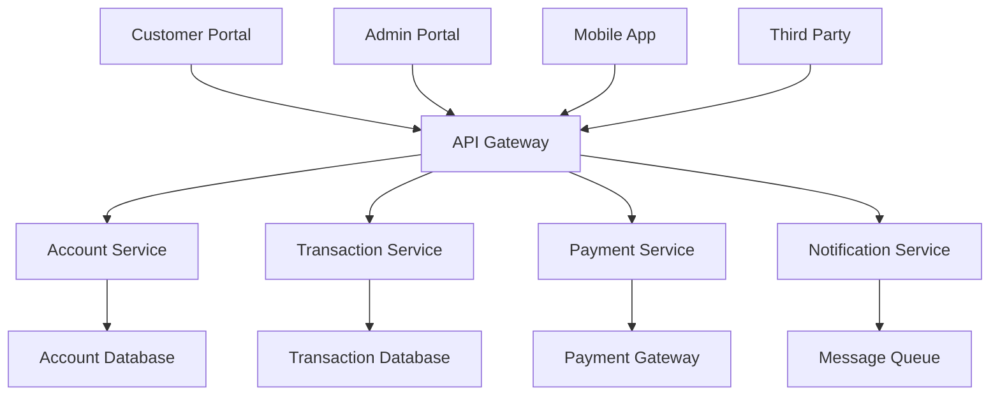

# Architecture System Design

## Design Process

System design is the process of defining the architecture, modules, interfaces, and data for a system to satisfy specified requirements. It involves breaking down complex problems into manageable components while ensuring they work together effectively.

### System Decomposition

#### Functional Decomposition
**Definition:** Breaking down a system into smaller, manageable functional units based on business capabilities.

**Example - E-commerce Platform Decomposition:**
```
E-commerce Platform
├── User Management
│   ├── Authentication Service
│   ├── User Profile Service
│   └── Authorization Service
├── Product Management
│   ├── Product Catalog Service
│   ├── Inventory Service
│   └── Pricing Service
├── Order Management
│   ├── Shopping Cart Service
│   ├── Order Processing Service
│   └── Payment Service
├── Fulfillment
│   ├── Shipping Service
│   ├── Warehouse Management
│   └── Delivery Tracking
└── Analytics
    ├── Customer Analytics
    ├── Sales Analytics
    └── Recommendation Engine
```

**Domain-Driven Design (DDD) Approach:**
```python
# Bounded Context: Order Management
class OrderDomain:
    class Order:
        def __init__(self, customer_id, items):
            self.order_id = self._generate_id()
            self.customer_id = customer_id
            self.items = items
            self.status = OrderStatus.PENDING
            self.total = self._calculate_total()
        
        def add_item(self, item):
            if self.status != OrderStatus.PENDING:
                raise InvalidOperationError("Cannot modify confirmed order")
            self.items.append(item)
            self.total = self._calculate_total()
        
        def confirm(self):
            if not self.items:
                raise BusinessRuleError("Cannot confirm empty order")
            self.status = OrderStatus.CONFIRMED
            return OrderConfirmedEvent(self.order_id, self.customer_id)

    class OrderService:
        def __init__(self, order_repository, inventory_service, payment_service):
            self.order_repository = order_repository
            self.inventory_service = inventory_service
            self.payment_service = payment_service
        
        def place_order(self, order):
            # Business logic orchestration
            self.inventory_service.reserve_items(order.items)
            payment_result = self.payment_service.process_payment(order.total)
            
            if payment_result.successful:
                order.confirm()
                self.order_repository.save(order)
                return order
            else:
                self.inventory_service.release_items(order.items)
                raise PaymentFailedException()

# Bounded Context: Inventory Management
class InventoryDomain:
    class Product:
        def __init__(self, sku, name, quantity_available):
            self.sku = sku
            self.name = name
            self.quantity_available = quantity_available
            self.reserved_quantity = 0
        
        def reserve(self, quantity):
            if self.quantity_available < quantity:
                raise InsufficientInventoryError()
            self.quantity_available -= quantity
            self.reserved_quantity += quantity
        
        def release_reservation(self, quantity):
            self.reserved_quantity -= quantity
            self.quantity_available += quantity
```

#### Component Identification
**Process:** Identifying discrete, cohesive units of functionality that can be developed and deployed independently.

**Component Identification Criteria:**
1. **Single Responsibility:** Each component has one primary purpose
2. **High Cohesion:** Related functionality grouped together
3. **Loose Coupling:** Minimal dependencies between components
4. **Business Alignment:** Components align with business capabilities

**Example - Banking System Components:**


**Component Specification Example:**
```yaml
# Account Service Component
component:
  name: account-service
  version: "1.2.0"
  description: "Manages customer account information and balances"
  
  responsibilities:
    - Account creation and management
    - Balance inquiries
    - Account status management
    - Account validation
  
  interfaces:
    provided:
      - name: AccountAPI
        type: REST
        endpoint: "/api/v1/accounts"
        operations:
          - GET /accounts/{accountId}
          - POST /accounts
          - PUT /accounts/{accountId}
          - GET /accounts/{accountId}/balance
    
    required:
      - name: AuditService
        type: Event
        events:
          - AccountCreated
          - AccountUpdated
          - BalanceChanged
  
  data:
    owned:
      - Account entities
      - Account balances
      - Account metadata
    
    accessed:
      - Customer data (read-only)
      - Audit events (write-only)
  
  non_functional:
    performance:
      response_time: "< 200ms for 95% of requests"
      throughput: "1000 requests/second"
    
    availability: "99.9%"
    
    scalability:
      horizontal: true
      max_instances: 20
```

#### Interface Definition
**Purpose:** Define clear contracts between components to enable independent development and testing.

**Interface Design Principles:**
1. **Stability:** Interfaces should be stable and backwards compatible
2. **Simplicity:** Keep interfaces as simple as possible
3. **Versioning:** Support multiple interface versions
4. **Documentation:** Comprehensive interface documentation

**Example - Order Processing Interface:**
```python
from abc import ABC, abstractmethod
from typing import List, Optional
from dataclasses import dataclass
from enum import Enum

class OrderStatus(Enum):
    PENDING = "pending"
    CONFIRMED = "confirmed"
    SHIPPED = "shipped"
    DELIVERED = "delivered"
    CANCELLED = "cancelled"

@dataclass
class OrderItem:
    product_id: str
    quantity: int
    price: float

@dataclass
class Order:
    order_id: str
    customer_id: str
    items: List[OrderItem]
    status: OrderStatus
    total_amount: float
    created_at: str

@dataclass
class OrderRequest:
    customer_id: str
    items: List[OrderItem]
    shipping_address: str
    payment_method: str

class OrderProcessingInterface(ABC):
    """Interface for order processing operations"""
    
    @abstractmethod
    def create_order(self, request: OrderRequest) -> Order:
        """
        Create a new order
        
        Args:
            request: Order creation request
            
        Returns:
            Created order
            
        Raises:
            InvalidOrderError: If order data is invalid
            InsufficientInventoryError: If items not available
            PaymentError: If payment processing fails
        """
        pass
    
    @abstractmethod
    def get_order(self, order_id: str) -> Optional[Order]:
        """Get order by ID"""
        pass
    
    @abstractmethod
    def update_order_status(self, order_id: str, status: OrderStatus) -> Order:
        """Update order status"""
        pass
    
    @abstractmethod
    def cancel_order(self, order_id: str, reason: str) -> Order:
        """Cancel an existing order"""
        pass

# Concrete implementation
class OrderProcessingService(OrderProcessingInterface):
    def __init__(self, inventory_service, payment_service, notification_service):
        self.inventory_service = inventory_service
        self.payment_service = payment_service
        self.notification_service = notification_service
    
    def create_order(self, request: OrderRequest) -> Order:
        # Validate request
        self._validate_order_request(request)
        
        # Check inventory
        self.inventory_service.check_availability(request.items)
        
        # Create order
        order = Order(
            order_id=self._generate_order_id(),
            customer_id=request.customer_id,
            items=request.items,
            status=OrderStatus.PENDING,
            total_amount=self._calculate_total(request.items),
            created_at=datetime.utcnow().isoformat()
        )
        
        # Process payment
        payment_result = self.payment_service.process_payment(
            order.total_amount, 
            request.payment_method
        )
        
        if payment_result.successful:
            order.status = OrderStatus.CONFIRMED
            self.inventory_service.reserve_items(request.items)
            self.notification_service.send_order_confirmation(order)
        
        return order
```

#### Dependency Mapping
**Purpose:** Understand and visualize relationships between system components to identify potential issues and optimization opportunities.

**Dependency Analysis Example:**
```python
# Dependency mapping for microservices
class DependencyMapper:
    def __init__(self):
        self.dependencies = {}
    
    def add_dependency(self, service, depends_on, dependency_type="sync"):
        if service not in self.dependencies:
            self.dependencies[service] = []
        
        self.dependencies[service].append({
            'target': depends_on,
            'type': dependency_type,
            'criticality': self._assess_criticality(dependency_type)
        })
    
    def analyze_dependencies(self):
        """Analyze dependency structure for potential issues"""
        analysis = {
            'circular_dependencies': self._find_circular_dependencies(),
            'high_coupling': self._find_high_coupling(),
            'single_points_of_failure': self._find_spof(),
            'dependency_depth': self._calculate_dependency_depth()
        }
        return analysis
    
    def _find_circular_dependencies(self):
        """Detect circular dependencies using DFS"""
        visited = set()
        rec_stack = set()
        cycles = []
        
        def dfs(node, path):
            if node in rec_stack:
                cycle_start = path.index(node)
                cycles.append(path[cycle_start:] + [node])
                return
            
            if node in visited:
                return
            
            visited.add(node)
            rec_stack.add(node)
            
            for dep in self.dependencies.get(node, []):
                dfs(dep['target'], path + [node])
            
            rec_stack.remove(node)
        
        for service in self.dependencies:
            if service not in visited:
                dfs(service, [])
        
        return cycles

# Example usage
mapper = DependencyMapper()

# Define service dependencies
mapper.add_dependency('order-service', 'payment-service', 'sync')
mapper.add_dependency('order-service', 'inventory-service', 'sync')
mapper.add_dependency('order-service', 'notification-service', 'async')
mapper.add_dependency('payment-service', 'fraud-detection-service', 'sync')
mapper.add_dependency('inventory-service', 'product-service', 'sync')
mapper.add_dependency('notification-service', 'email-service', 'async')

# Generate dependency report
analysis = mapper.analyze_dependencies()
```

**Dependency Visualization (ASCII):**
```
Service Dependency Graph:
                    ┌─────────────────┐
                    │  order-service  │
                    └─────────┬───────┘
                              │
                    ┌─────────┼─────────┐
                    │         │         │
                    ▼         ▼         ▼
           ┌─────────────┐ ┌──────────┐ ┌──────────────────┐
           │payment-svc  │ │inventory-│ │notification-svc  │
           │             │ │service   │ │                  │
           └─────┬───────┘ └────┬─────┘ └─────────┬────────┘
                 │              │                 │
                 ▼              ▼                 ▼
         ┌──────────────┐ ┌──────────────┐ ┌──────────────┐
         │fraud-detection│ │product-service│ │email-service │
         │              │ │              │ │              │
         └──────────────┘ └──────────────┘ └──────────────┘

Dependency Types:
─── Synchronous (blocking)
┄┄┄ Asynchronous (non-blocking)
```

### Component Design

#### Component Responsibilities
**Principle:** Each component should have clearly defined responsibilities that align with business capabilities.

**Example - User Management Component:**
```python
class UserManagementComponent:
    """
    Responsible for all user-related operations
    
    Responsibilities:
    - User registration and authentication
    - User profile management
    - User preferences and settings
    - User lifecycle management
    """
    
    def __init__(self, user_repository, password_service, email_service):
        self.user_repository = user_repository
        self.password_service = password_service
        self.email_service = email_service
    
    # Core user operations
    def register_user(self, registration_data):
        """Register a new user"""
        # Validation
        self._validate_registration_data(registration_data)
        
        # Business rules
        if self.user_repository.email_exists(registration_data.email):
            raise UserAlreadyExistsError()
        
        # Create user
        user = User(
            email=registration_data.email,
            password_hash=self.password_service.hash_password(registration_data.password),
            profile=UserProfile.from_registration(registration_data),
            status=UserStatus.PENDING_VERIFICATION
        )
        
        # Persist
        saved_user = self.user_repository.save(user)
        
        # Send verification email
        self.email_service.send_verification_email(saved_user.email, saved_user.verification_token)
        
        return saved_user
    
    def authenticate_user(self, email, password):
        """Authenticate user credentials"""
        user = self.user_repository.find_by_email(email)
        
        if not user or not self.password_service.verify_password(password, user.password_hash):
            raise InvalidCredentialsError()
        
        if user.status == UserStatus.SUSPENDED:
            raise UserSuspendedError()
        
        # Update last login
        user.last_login = datetime.utcnow()
        self.user_repository.save(user)
        
        return user
    
    def update_profile(self, user_id, profile_updates):
        """Update user profile information"""
        user = self.user_repository.find_by_id(user_id)
        
        if not user:
            raise UserNotFoundError()
        
        # Validate updates
        self._validate_profile_updates(profile_updates)
        
        # Apply updates
        user.profile.update(profile_updates)
        user.updated_at = datetime.utcnow()
        
        return self.user_repository.save(user)
```

#### Interface Contracts
**Purpose:** Define formal agreements between components about how they interact.

**Contract-Driven Development Example:**
```yaml
# Service Contract Definition
service_contract:
  name: "UserService"
  version: "2.1.0"
  
  operations:
    - name: "createUser"
      input:
        type: "UserRegistrationRequest"
        validation:
          email:
            required: true
            format: "email"
          password:
            required: true
            min_length: 8
            complexity: "high"
          first_name:
            required: true
            max_length: 50
          last_name:
            required: true
            max_length: 50
      
      output:
        success:
          type: "User"
          fields: ["id", "email", "first_name", "last_name", "created_at"]
        
        errors:
          - code: "VALIDATION_ERROR"
            http_status: 400
            description: "Input validation failed"
          - code: "USER_EXISTS"
            http_status: 409
            description: "User with email already exists"
          - code: "INTERNAL_ERROR"
            http_status: 500
            description: "Internal server error"
      
      constraints:
        response_time: "< 500ms"
        rate_limit: "100 requests/minute/client"
        idempotent: false
        transactional: true

# Contract Testing
class UserServiceContractTest:
    def test_create_user_success(self):
        # Given
        request = UserRegistrationRequest(
            email="john.doe@example.com",
            password="SecurePass123!",
            first_name="John",
            last_name="Doe"
        )
        
        # When
        response = self.user_service.create_user(request)
        
        # Then
        assert response.status == "success"
        assert response.data.email == request.email
        assert response.data.id is not None
        assert "password" not in response.data.__dict__
    
    def test_create_user_validation_error(self):
        # Given
        request = UserRegistrationRequest(
            email="invalid-email",
            password="weak",
            first_name="",
            last_name="Doe"
        )
        
        # When/Then
        with pytest.raises(ValidationError) as exc_info:
            self.user_service.create_user(request)
        
        assert exc_info.value.code == "VALIDATION_ERROR"
        assert "email" in exc_info.value.details
        assert "password" in exc_info.value.details
```

#### Communication Patterns
**Types of inter-component communication and when to use each.**

**1. Synchronous Communication (Request-Response):**
```python
# Direct method invocation
class OrderService:
    def __init__(self, payment_service, inventory_service):
        self.payment_service = payment_service
        self.inventory_service = inventory_service
    
    def process_order(self, order):
        # Synchronous calls - blocking
        inventory_result = self.inventory_service.reserve_items(order.items)
        
        if inventory_result.success:
            payment_result = self.payment_service.charge_card(
                order.total, 
                order.payment_info
            )
            
            if payment_result.success:
                return OrderResult.success(order)
            else:
                # Compensating action
                self.inventory_service.release_items(order.items)
                return OrderResult.failure("Payment failed")
        
        return OrderResult.failure("Insufficient inventory")

# HTTP API calls
class PaymentServiceClient:
    def __init__(self, base_url, timeout=30):
        self.base_url = base_url
        self.timeout = timeout
        self.session = requests.Session()
    
    def charge_card(self, amount, card_token):
        try:
            response = self.session.post(
                f"{self.base_url}/payments",
                json={
                    "amount": amount,
                    "card_token": card_token,
                    "currency": "USD"
                },
                timeout=self.timeout
            )
            response.raise_for_status()
            return PaymentResult.from_response(response.json())
        
        except requests.exceptions.Timeout:
            raise PaymentTimeoutError()
        except requests.exceptions.RequestException as e:
            raise PaymentServiceError(str(e))
```

**2. Asynchronous Communication (Message-Driven):**
```python
# Event-driven communication
class OrderEventPublisher:
    def __init__(self, message_broker):
        self.message_broker = message_broker
    
    def publish_order_created(self, order):
        event = OrderCreatedEvent(
            order_id=order.id,
            customer_id=order.customer_id,
            items=order.items,
            total=order.total,
            timestamp=datetime.utcnow()
        )
        
        self.message_broker.publish(
            topic="order.created",
            message=event.to_json(),
            partition_key=order.customer_id
        )

class InventoryEventHandler:
    def __init__(self, inventory_service):
        self.inventory_service = inventory_service
    
    def handle_order_created(self, event):
        """Handle order created event asynchronously"""
        try:
            order_created = OrderCreatedEvent.from_json(event.data)
            self.inventory_service.reserve_items(order_created.items)
            
            # Publish inventory reserved event
            self._publish_inventory_reserved(order_created.order_id)
            
        except InsufficientInventoryError:
            self._publish_inventory_insufficient(order_created.order_id)
        except Exception as e:
            # Send to dead letter queue
            self._send_to_dlq(event, str(e))

# Message queue setup
class MessageBrokerConfig:
    def setup_order_processing(self):
        # Topic configuration
        topics = [
            Topic("order.created", partitions=12, replication_factor=3),
            Topic("inventory.reserved", partitions=12, replication_factor=3),
            Topic("payment.processed", partitions=12, replication_factor=3),
            Topic("order.fulfilled", partitions=12, replication_factor=3)
        ]
        
        # Consumer groups
        consumer_groups = [
            ConsumerGroup("inventory-service", ["order.created"]),
            ConsumerGroup("payment-service", ["inventory.reserved"]),
            ConsumerGroup("notification-service", ["order.fulfilled"]),
            ConsumerGroup("analytics-service", ["order.created", "order.fulfilled"])
        ]
        
        return MessageBrokerSetup(topics, consumer_groups)
```

**3. Hybrid Communication Pattern (Saga Pattern):**
```python
class OrderSagaOrchestrator:
    """
    Orchestrates distributed transaction using saga pattern
    Combines sync and async communication
    """
    
    def __init__(self, services, event_store):
        self.inventory_service = services['inventory']
        self.payment_service = services['payment']
        self.shipping_service = services['shipping']
        self.event_store = event_store
    
    async def process_order(self, order):
        saga_id = f"order-saga-{order.id}"
        
        try:
            # Step 1: Reserve inventory (sync)
            inventory_result = await self.inventory_service.reserve_items(
                order.items, 
                saga_id
            )
            self._log_saga_step(saga_id, "inventory_reserved", inventory_result)
            
            # Step 2: Process payment (sync)
            payment_result = await self.payment_service.charge_card(
                order.total, 
                order.payment_info,
                saga_id
            )
            self._log_saga_step(saga_id, "payment_processed", payment_result)
            
            # Step 3: Create shipment (async)
            shipment_result = await self.shipping_service.create_shipment(
                order,
                saga_id
            )
            self._log_saga_step(saga_id, "shipment_created", shipment_result)
            
            # Success - commit all
            await self._commit_saga(saga_id)
            return OrderResult.success(order)
            
        except Exception as e:
            # Failure - compensate all completed steps
            await self._compensate_saga(saga_id)
            return OrderResult.failure(str(e))
    
    async def _compensate_saga(self, saga_id):
        """Compensate completed saga steps in reverse order"""
        saga_log = self.event_store.get_saga_log(saga_id)
        
        for step in reversed(saga_log.completed_steps):
            if step.name == "shipment_created":
                await self.shipping_service.cancel_shipment(step.data.shipment_id)
            elif step.name == "payment_processed":
                await self.payment_service.refund_payment(step.data.payment_id)
            elif step.name == "inventory_reserved":
                await self.inventory_service.release_reservation(step.data.reservation_id)
```

This comprehensive System Design section provides detailed guidance on decomposing systems, designing components, defining interfaces, and implementing communication patterns with practical, production-ready examples.