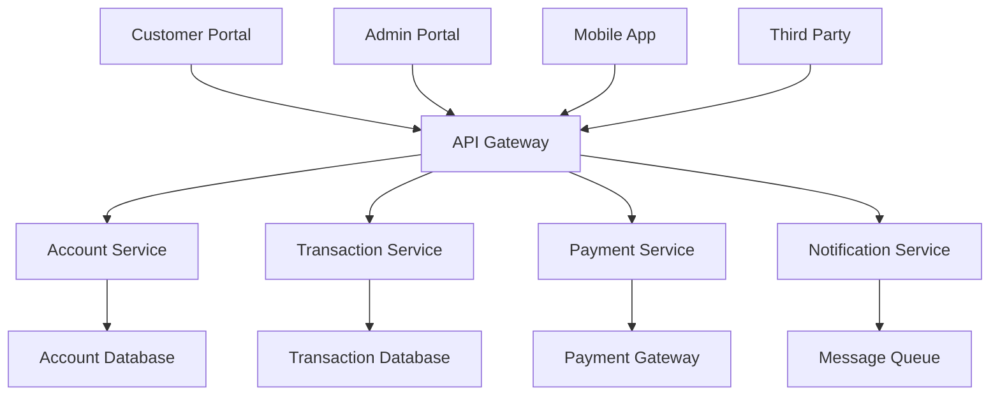

# Architecture System Design

## Design Process

System design is the process of defining the architecture, modules, interfaces, and data for a system to satisfy specified requirements. It involves breaking down complex problems into manageable components while ensuring they work together effectively.

### System Decomposition

#### Functional Decomposition
**Definition:** Breaking down a system into smaller, manageable functional units based on business capabilities.

**Example - E-commerce Platform Decomposition:**
```
E-commerce Platform
├── User Management
│   ├── Authentication Service
│   ├── User Profile Service
│   └── Authorization Service
├── Product Management
│   ├── Product Catalog Service
│   ├── Inventory Service
│   └── Pricing Service
├── Order Management
│   ├── Shopping Cart Service
│   ├── Order Processing Service
│   └── Payment Service
├── Fulfillment
│   ├── Shipping Service
│   ├── Warehouse Management
│   └── Delivery Tracking
└── Analytics
    ├── Customer Analytics
    ├── Sales Analytics
    └── Recommendation Engine
```

**Domain-Driven Design (DDD) Approach:**
```python
# Bounded Context: Order Management
class OrderDomain:
    class Order:
        def __init__(self, customer_id, items):
            self.order_id = self._generate_id()
            self.customer_id = customer_id
            self.items = items
            self.status = OrderStatus.PENDING
            self.total = self._calculate_total()
        
        def add_item(self, item):
            if self.status != OrderStatus.PENDING:
                raise InvalidOperationError("Cannot modify confirmed order")
            self.items.append(item)
            self.total = self._calculate_total()
        
        def confirm(self):
            if not self.items:
                raise BusinessRuleError("Cannot confirm empty order")
            self.status = OrderStatus.CONFIRMED
            return OrderConfirmedEvent(self.order_id, self.customer_id)

    class OrderService:
        def __init__(self, order_repository, inventory_service, payment_service):
            self.order_repository = order_repository
            self.inventory_service = inventory_service
            self.payment_service = payment_service
        
        def place_order(self, order):
            # Business logic orchestration
            self.inventory_service.reserve_items(order.items)
            payment_result = self.payment_service.process_payment(order.total)
            
            if payment_result.successful:
                order.confirm()
                self.order_repository.save(order)
                return order
            else:
                self.inventory_service.release_items(order.items)
                raise PaymentFailedException()

# Bounded Context: Inventory Management
class InventoryDomain:
    class Product:
        def __init__(self, sku, name, quantity_available):
            self.sku = sku
            self.name = name
            self.quantity_available = quantity_available
            self.reserved_quantity = 0
        
        def reserve(self, quantity):
            if self.quantity_available < quantity:
                raise InsufficientInventoryError()
            self.quantity_available -= quantity
            self.reserved_quantity += quantity
        
        def release_reservation(self, quantity):
            self.reserved_quantity -= quantity
            self.quantity_available += quantity
```

#### Component Identification
**Process:** Identifying discrete, cohesive units of functionality that can be developed and deployed independently.

**Component Identification Criteria:**
1. **Single Responsibility:** Each component has one primary purpose
2. **High Cohesion:** Related functionality grouped together
3. **Loose Coupling:** Minimal dependencies between components
4. **Business Alignment:** Components align with business capabilities

**Example - Banking System Components:**


**Component Specification Example:**
```yaml
# Account Service Component
component:
  name: account-service
  version: "1.2.0"
  description: "Manages customer account information and balances"
  
  responsibilities:
    - Account creation and management
    - Balance inquiries
    - Account status management
    - Account validation
  
  interfaces:
    provided:
      - name: AccountAPI
        type: REST
        endpoint: "/api/v1/accounts"
        operations:
          - GET /accounts/{accountId}
          - POST /accounts
          - PUT /accounts/{accountId}
          - GET /accounts/{accountId}/balance
    
    required:
      - name: AuditService
        type: Event
        events:
          - AccountCreated
          - AccountUpdated
          - BalanceChanged
  
  data:
    owned:
      - Account entities
      - Account balances
      - Account metadata
    
    accessed:
      - Customer data (read-only)
      - Audit events (write-only)
  
  non_functional:
    performance:
      response_time: "< 200ms for 95% of requests"
      throughput: "1000 requests/second"
    
    availability: "99.9%"
    
    scalability:
      horizontal: true
      max_instances: 20
```

#### Interface Definition
**Purpose:** Define clear contracts between components to enable independent development and testing.

**Interface Design Principles:**
1. **Stability:** Interfaces should be stable and backwards compatible
2. **Simplicity:** Keep interfaces as simple as possible
3. **Versioning:** Support multiple interface versions
4. **Documentation:** Comprehensive interface documentation

**Example - Order Processing Interface:**
```python
from abc import ABC, abstractmethod
from typing import List, Optional
from dataclasses import dataclass
from enum import Enum

class OrderStatus(Enum):
    PENDING = "pending"
    CONFIRMED = "confirmed"
    SHIPPED = "shipped"
    DELIVERED = "delivered"
    CANCELLED = "cancelled"

@dataclass
class OrderItem:
    product_id: str
    quantity: int
    price: float

@dataclass
class Order:
    order_id: str
    customer_id: str
    items: List[OrderItem]
    status: OrderStatus
    total_amount: float
    created_at: str

@dataclass
class OrderRequest:
    customer_id: str
    items: List[OrderItem]
    shipping_address: str
    payment_method: str

class OrderProcessingInterface(ABC):
    """Interface for order processing operations"""
    
    @abstractmethod
    def create_order(self, request: OrderRequest) -> Order:
        """
        Create a new order
        
        Args:
            request: Order creation request
            
        Returns:
            Created order
            
        Raises:
            InvalidOrderError: If order data is invalid
            InsufficientInventoryError: If items not available
            PaymentError: If payment processing fails
        """
        pass
    
    @abstractmethod
    def get_order(self, order_id: str) -> Optional[Order]:
        """Get order by ID"""
        pass
    
    @abstractmethod
    def update_order_status(self, order_id: str, status: OrderStatus) -> Order:
        """Update order status"""
        pass
    
    @abstractmethod
    def cancel_order(self, order_id: str, reason: str) -> Order:
        """Cancel an existing order"""
        pass

# Concrete implementation
class OrderProcessingService(OrderProcessingInterface):
    def __init__(self, inventory_service, payment_service, notification_service):
        self.inventory_service = inventory_service
        self.payment_service = payment_service
        self.notification_service = notification_service
    
    def create_order(self, request: OrderRequest) -> Order:
        # Validate request
        self._validate_order_request(request)
        
        # Check inventory
        self.inventory_service.check_availability(request.items)
        
        # Create order
        order = Order(
            order_id=self._generate_order_id(),
            customer_id=request.customer_id,
            items=request.items,
            status=OrderStatus.PENDING,
            total_amount=self._calculate_total(request.items),
            created_at=datetime.utcnow().isoformat()
        )
        
        # Process payment
        payment_result = self.payment_service.process_payment(
            order.total_amount, 
            request.payment_method
        )
        
        if payment_result.successful:
            order.status = OrderStatus.CONFIRMED
            self.inventory_service.reserve_items(request.items)
            self.notification_service.send_order_confirmation(order)
        
        return order
```

#### Dependency Mapping
**Purpose:** Understand and visualize relationships between system components to identify potential issues and optimization opportunities.

**Dependency Analysis Example:**
```python
# Dependency mapping for microservices
class DependencyMapper:
    def __init__(self):
        self.dependencies = {}
    
    def add_dependency(self, service, depends_on, dependency_type="sync"):
        if service not in self.dependencies:
            self.dependencies[service] = []
        
        self.dependencies[service].append({
            'target': depends_on,
            'type': dependency_type,
            'criticality': self._assess_criticality(dependency_type)
        })
    
    def analyze_dependencies(self):
        """Analyze dependency structure for potential issues"""
        analysis = {
            'circular_dependencies': self._find_circular_dependencies(),
            'high_coupling': self._find_high_coupling(),
            'single_points_of_failure': self._find_spof(),
            'dependency_depth': self._calculate_dependency_depth()
        }
        return analysis
    
    def _find_circular_dependencies(self):
        """Detect circular dependencies using DFS"""
        visited = set()
        rec_stack = set()
        cycles = []
        
        def dfs(node, path):
            if node in rec_stack:
                cycle_start = path.index(node)
                cycles.append(path[cycle_start:] + [node])
                return
            
            if node in visited:
                return
            
            visited.add(node)
            rec_stack.add(node)
            
            for dep in self.dependencies.get(node, []):
                dfs(dep['target'], path + [node])
            
            rec_stack.remove(node)
        
        for service in self.dependencies:
            if service not in visited:
                dfs(service, [])
        
        return cycles

# Example usage
mapper = DependencyMapper()

# Define service dependencies
mapper.add_dependency('order-service', 'payment-service', 'sync')
mapper.add_dependency('order-service', 'inventory-service', 'sync')
mapper.add_dependency('order-service', 'notification-service', 'async')
mapper.add_dependency('payment-service', 'fraud-detection-service', 'sync')
mapper.add_dependency('inventory-service', 'product-service', 'sync')
mapper.add_dependency('notification-service', 'email-service', 'async')

# Generate dependency report
analysis = mapper.analyze_dependencies()
```

**Dependency Visualization (ASCII):**
```
Service Dependency Graph:
                    ┌─────────────────┐
                    │  order-service  │
                    └─────────┬───────┘
                              │
                    ┌─────────┼─────────┐
                    │         │         │
                    ▼         ▼         ▼
           ┌─────────────┐ ┌──────────┐ ┌──────────────────┐
           │payment-svc  │ │inventory-│ │notification-svc  │
           │             │ │service   │ │                  │
           └─────┬───────┘ └────┬─────┘ └─────────┬────────┘
                 │              │                 │
                 ▼              ▼                 ▼
         ┌──────────────┐ ┌──────────────┐ ┌──────────────┐
         │fraud-detection│ │product-service│ │email-service │
         │              │ │              │ │              │
         └──────────────┘ └──────────────┘ └──────────────┘

Dependency Types:
─── Synchronous (blocking)
┄┄┄ Asynchronous (non-blocking)
```

### Component Design

#### Component Responsibilities
**Principle:** Each component should have clearly defined responsibilities that align with business capabilities.

**Example - User Management Component:**
```python
class UserManagementComponent:
    """
    Responsible for all user-related operations
    
    Responsibilities:
    - User registration and authentication
    - User profile management
    - User preferences and settings
    - User lifecycle management
    """
    
    def __init__(self, user_repository, password_service, email_service):
        self.user_repository = user_repository
        self.password_service = password_service
        self.email_service = email_service
    
    # Core user operations
    def register_user(self, registration_data):
        """Register a new user"""
        # Validation
        self._validate_registration_data(registration_data)
        
        # Business rules
        if self.user_repository.email_exists(registration_data.email):
            raise UserAlreadyExistsError()
        
        # Create user
        user = User(
            email=registration_data.email,
            password_hash=self.password_service.hash_password(registration_data.password),
            profile=UserProfile.from_registration(registration_data),
            status=UserStatus.PENDING_VERIFICATION
        )
        
        # Persist
        saved_user = self.user_repository.save(user)
        
        # Send verification email
        self.email_service.send_verification_email(saved_user.email, saved_user.verification_token)
        
        return saved_user
    
    def authenticate_user(self, email, password):
        """Authenticate user credentials"""
        user = self.user_repository.find_by_email(email)
        
        if not user or not self.password_service.verify_password(password, user.password_hash):
            raise InvalidCredentialsError()
        
        if user.status == UserStatus.SUSPENDED:
            raise UserSuspendedError()
        
        # Update last login
        user.last_login = datetime.utcnow()
        self.user_repository.save(user)
        
        return user
    
    def update_profile(self, user_id, profile_updates):
        """Update user profile information"""
        user = self.user_repository.find_by_id(user_id)
        
        if not user:
            raise UserNotFoundError()
        
        # Validate updates
        self._validate_profile_updates(profile_updates)
        
        # Apply updates
        user.profile.update(profile_updates)
        user.updated_at = datetime.utcnow()
        
        return self.user_repository.save(user)
```

#### Interface Contracts
**Purpose:** Define formal agreements between components about how they interact.

**Contract-Driven Development Example:**
```yaml
# Service Contract Definition
service_contract:
  name: "UserService"
  version: "2.1.0"
  
  operations:
    - name: "createUser"
      input:
        type: "UserRegistrationRequest"
        validation:
          email:
            required: true
            format: "email"
          password:
            required: true
            min_length: 8
            complexity: "high"
          first_name:
            required: true
            max_length: 50
          last_name:
            required: true
            max_length: 50
      
      output:
        success:
          type: "User"
          fields: ["id", "email", "first_name", "last_name", "created_at"]
        
        errors:
          - code: "VALIDATION_ERROR"
            http_status: 400
            description: "Input validation failed"
          - code: "USER_EXISTS"
            http_status: 409
            description: "User with email already exists"
          - code: "INTERNAL_ERROR"
            http_status: 500
            description: "Internal server error"
      
      constraints:
        response_time: "< 500ms"
        rate_limit: "100 requests/minute/client"
        idempotent: false
        transactional: true

# Contract Testing
class UserServiceContractTest:
    def test_create_user_success(self):
        # Given
        request = UserRegistrationRequest(
            email="john.doe@example.com",
            password="SecurePass123!",
            first_name="John",
            last_name="Doe"
        )
        
        # When
        response = self.user_service.create_user(request)
        
        # Then
        assert response.status == "success"
        assert response.data.email == request.email
        assert response.data.id is not None
        assert "password" not in response.data.__dict__
    
    def test_create_user_validation_error(self):
        # Given
        request = UserRegistrationRequest(
            email="invalid-email",
            password="weak",
            first_name="",
            last_name="Doe"
        )
        
        # When/Then
        with pytest.raises(ValidationError) as exc_info:
            self.user_service.create_user(request)
        
        assert exc_info.value.code == "VALIDATION_ERROR"
        assert "email" in exc_info.value.details
        assert "password" in exc_info.value.details
```

#### Communication Patterns
**Types of inter-component communication and when to use each.**

**1. Synchronous Communication (Request-Response):**
```python
# Direct method invocation
class OrderService:
    def __init__(self, payment_service, inventory_service):
        self.payment_service = payment_service
        self.inventory_service = inventory_service
    
    def process_order(self, order):
        # Synchronous calls - blocking
        inventory_result = self.inventory_service.reserve_items(order.items)
        
        if inventory_result.success:
            payment_result = self.payment_service.charge_card(
                order.total, 
                order.payment_info
            )
            
            if payment_result.success:
                return OrderResult.success(order)
            else:
                # Compensating action
                self.inventory_service.release_items(order.items)
                return OrderResult.failure("Payment failed")
        
        return OrderResult.failure("Insufficient inventory")

# HTTP API calls
class PaymentServiceClient:
    def __init__(self, base_url, timeout=30):
        self.base_url = base_url
        self.timeout = timeout
        self.session = requests.Session()
    
    def charge_card(self, amount, card_token):
        try:
            response = self.session.post(
                f"{self.base_url}/payments",
                json={
                    "amount": amount,
                    "card_token": card_token,
                    "currency": "USD"
                },
                timeout=self.timeout
            )
            response.raise_for_status()
            return PaymentResult.from_response(response.json())
        
        except requests.exceptions.Timeout:
            raise PaymentTimeoutError()
        except requests.exceptions.RequestException as e:
            raise PaymentServiceError(str(e))
```

**2. Asynchronous Communication (Message-Driven):**
```python
# Event-driven communication
class OrderEventPublisher:
    def __init__(self, message_broker):
        self.message_broker = message_broker
    
    def publish_order_created(self, order):
        event = OrderCreatedEvent(
            order_id=order.id,
            customer_id=order.customer_id,
            items=order.items,
            total=order.total,
            timestamp=datetime.utcnow()
        )
        
        self.message_broker.publish(
            topic="order.created",
            message=event.to_json(),
            partition_key=order.customer_id
        )

class InventoryEventHandler:
    def __init__(self, inventory_service):
        self.inventory_service = inventory_service
    
    def handle_order_created(self, event):
        """Handle order created event asynchronously"""
        try:
            order_created = OrderCreatedEvent.from_json(event.data)
            self.inventory_service.reserve_items(order_created.items)
            
            # Publish inventory reserved event
            self._publish_inventory_reserved(order_created.order_id)
            
        except InsufficientInventoryError:
            self._publish_inventory_insufficient(order_created.order_id)
        except Exception as e:
            # Send to dead letter queue
            self._send_to_dlq(event, str(e))

# Message queue setup
class MessageBrokerConfig:
    def setup_order_processing(self):
        # Topic configuration
        topics = [
            Topic("order.created", partitions=12, replication_factor=3),
            Topic("inventory.reserved", partitions=12, replication_factor=3),
            Topic("payment.processed", partitions=12, replication_factor=3),
            Topic("order.fulfilled", partitions=12, replication_factor=3)
        ]
        
        # Consumer groups
        consumer_groups = [
            ConsumerGroup("inventory-service", ["order.created"]),
            ConsumerGroup("payment-service", ["inventory.reserved"]),
            ConsumerGroup("notification-service", ["order.fulfilled"]),
            ConsumerGroup("analytics-service", ["order.created", "order.fulfilled"])
        ]
        
        return MessageBrokerSetup(topics, consumer_groups)
```

**3. Hybrid Communication Pattern (Saga Pattern):**
```python
class OrderSagaOrchestrator:
    """
    Orchestrates distributed transaction using saga pattern
    Combines sync and async communication
    """
    
    def __init__(self, services, event_store):
        self.inventory_service = services['inventory']
        self.payment_service = services['payment']
        self.shipping_service = services['shipping']
        self.event_store = event_store
    
    async def process_order(self, order):
        saga_id = f"order-saga-{order.id}"
        
        try:
            # Step 1: Reserve inventory (sync)
            inventory_result = await self.inventory_service.reserve_items(
                order.items, 
                saga_id
            )
            self._log_saga_step(saga_id, "inventory_reserved", inventory_result)
            
            # Step 2: Process payment (sync)
            payment_result = await self.payment_service.charge_card(
                order.total, 
                order.payment_info,
                saga_id
            )
            self._log_saga_step(saga_id, "payment_processed", payment_result)
            
            # Step 3: Create shipment (async)
            shipment_result = await self.shipping_service.create_shipment(
                order,
                saga_id
            )
            self._log_saga_step(saga_id, "shipment_created", shipment_result)
            
            # Success - commit all
            await self._commit_saga(saga_id)
            return OrderResult.success(order)
            
        except Exception as e:
            # Failure - compensate all completed steps
            await self._compensate_saga(saga_id)
            return OrderResult.failure(str(e))
    
    async def _compensate_saga(self, saga_id):
        """Compensate completed saga steps in reverse order"""
        saga_log = self.event_store.get_saga_log(saga_id)
        
        for step in reversed(saga_log.completed_steps):
            if step.name == "shipment_created":
                await self.shipping_service.cancel_shipment(step.data.shipment_id)
            elif step.name == "payment_processed":
                await self.payment_service.refund_payment(step.data.payment_id)
            elif step.name == "inventory_reserved":
                await self.inventory_service.release_reservation(step.data.reservation_id)
```

### Advanced System Design Patterns

#### Circuit Breaker Pattern Implementation

```python
import time
import threading
from enum import Enum
from typing import Callable, Any, Optional
from dataclasses import dataclass
from datetime import datetime, timedelta

class CircuitState(Enum):
    CLOSED = "closed"
    OPEN = "open"
    HALF_OPEN = "half_open"

@dataclass
class CircuitBreakerConfig:
    failure_threshold: int = 5
    timeout_duration: int = 60  # seconds
    success_threshold: int = 3  # for half-open state
    monitor_window: int = 300   # seconds

class CircuitBreakerMetrics:
    def __init__(self, window_size: int = 300):
        self.window_size = window_size
        self.failures = []
        self.successes = []
        self.lock = threading.Lock()
    
    def record_success(self):
        with self.lock:
            now = time.time()
            self.successes.append(now)
            self._cleanup_old_records(now)
    
    def record_failure(self):
        with self.lock:
            now = time.time()
            self.failures.append(now)
            self._cleanup_old_records(now)
    
    def get_failure_rate(self) -> float:
        with self.lock:
            now = time.time()
            self._cleanup_old_records(now)
            
            total_requests = len(self.failures) + len(self.successes)
            if total_requests == 0:
                return 0.0
            
            return len(self.failures) / total_requests
    
    def _cleanup_old_records(self, current_time: float):
        cutoff = current_time - self.window_size
        self.failures = [f for f in self.failures if f > cutoff]
        self.successes = [s for s in self.successes if s > cutoff]

class CircuitBreaker:
    def __init__(self, name: str, config: CircuitBreakerConfig):
        self.name = name
        self.config = config
        self.state = CircuitState.CLOSED
        self.metrics = CircuitBreakerMetrics(config.monitor_window)
        self.last_failure_time = None
        self.half_open_successes = 0
        self.lock = threading.Lock()
    
    def call(self, func: Callable, *args, **kwargs) -> Any:
        """Execute function through circuit breaker protection"""
        with self.lock:
            if self.state == CircuitState.OPEN:
                if self._should_attempt_reset():
                    self.state = CircuitState.HALF_OPEN
                    self.half_open_successes = 0
                else:
                    raise CircuitBreakerOpenError(
                        f"Circuit breaker {self.name} is OPEN"
                    )
            
            if self.state == CircuitState.HALF_OPEN:
                if self.half_open_successes >= self.config.success_threshold:
                    self.state = CircuitState.CLOSED
                    self.half_open_successes = 0
        
        try:
            result = func(*args, **kwargs)
            self._record_success()
            return result
        
        except Exception as e:
            self._record_failure()
            raise e
    
    def _record_success(self):
        with self.lock:
            self.metrics.record_success()
            
            if self.state == CircuitState.HALF_OPEN:
                self.half_open_successes += 1
                if self.half_open_successes >= self.config.success_threshold:
                    self.state = CircuitState.CLOSED
    
    def _record_failure(self):
        with self.lock:
            self.metrics.record_failure()
            self.last_failure_time = time.time()
            
            if self.state == CircuitState.HALF_OPEN:
                self.state = CircuitState.OPEN
            elif self.state == CircuitState.CLOSED:
                failure_rate = self.metrics.get_failure_rate()
                if failure_rate >= (self.config.failure_threshold / 10):
                    self.state = CircuitState.OPEN
    
    def _should_attempt_reset(self) -> bool:
        if self.last_failure_time is None:
            return True
        
        return (time.time() - self.last_failure_time) >= self.config.timeout_duration

# Usage example
class ExternalServiceClient:
    def __init__(self):
        self.circuit_breaker = CircuitBreaker(
            "external-api",
            CircuitBreakerConfig(
                failure_threshold=5,
                timeout_duration=60,
                success_threshold=3
            )
        )
    
    def call_external_api(self, data):
        return self.circuit_breaker.call(self._make_api_call, data)
    
    def _make_api_call(self, data):
        # Actual API call implementation
        response = requests.post("https://api.external.com/data", json=data)
        response.raise_for_status()
        return response.json()
```

#### Rate Limiting and Throttling

```python
import time
import asyncio
from collections import deque, defaultdict
from typing import Dict, Optional, Tuple
import redis

class TokenBucket:
    """Token bucket algorithm for rate limiting"""
    
    def __init__(self, capacity: int, refill_rate: float):
        self.capacity = capacity
        self.tokens = capacity
        self.refill_rate = refill_rate  # tokens per second
        self.last_refill = time.time()
        self.lock = asyncio.Lock()
    
    async def consume(self, tokens: int = 1) -> bool:
        async with self.lock:
            now = time.time()
            # Refill tokens based on time elapsed
            elapsed = now - self.last_refill
            tokens_to_add = elapsed * self.refill_rate
            self.tokens = min(self.capacity, self.tokens + tokens_to_add)
            self.last_refill = now
            
            if self.tokens >= tokens:
                self.tokens -= tokens
                return True
            return False

class SlidingWindowRateLimiter:
    """Sliding window rate limiter with Redis backend"""
    
    def __init__(self, redis_client: redis.Redis, window_size: int = 3600):
        self.redis = redis_client
        self.window_size = window_size
    
    async def is_allowed(self, key: str, limit: int, window_size: int = None) -> Tuple[bool, Dict]:
        """Check if request is allowed and return rate limit info"""
        window_size = window_size or self.window_size
        now = time.time()
        window_start = now - window_size
        
        pipe = self.redis.pipeline()
        
        # Remove old entries
        pipe.zremrangebyscore(key, 0, window_start)
        
        # Count current requests in window
        pipe.zcard(key)
        
        # Add current request
        pipe.zadd(key, {str(now): now})
        
        # Set expiration
        pipe.expire(key, window_size + 1)
        
        results = pipe.execute()
        current_requests = results[1]
        
        allowed = current_requests < limit
        
        rate_limit_info = {
            'allowed': allowed,
            'limit': limit,
            'remaining': max(0, limit - current_requests - 1),
            'reset_time': int(now + window_size),
            'window_size': window_size
        }
        
        return allowed, rate_limit_info

class AdaptiveRateLimiter:
    """Adaptive rate limiter that adjusts based on system load"""
    
    def __init__(self, base_limit: int = 1000):
        self.base_limit = base_limit
        self.current_limit = base_limit
        self.system_metrics = SystemMetrics()
        self.adjustment_history = deque(maxlen=100)
    
    async def get_current_limit(self, client_id: str) -> int:
        """Get current rate limit based on system conditions"""
        cpu_usage = await self.system_metrics.get_cpu_usage()
        memory_usage = await self.system_metrics.get_memory_usage()
        error_rate = await self.system_metrics.get_error_rate()
        
        # Calculate adjustment factor based on system health
        load_factor = self._calculate_load_factor(cpu_usage, memory_usage, error_rate)
        
        # Apply client-specific adjustments
        client_tier = await self._get_client_tier(client_id)
        tier_multiplier = self._get_tier_multiplier(client_tier)
        
        adjusted_limit = int(self.base_limit * load_factor * tier_multiplier)
        
        self.adjustment_history.append({
            'timestamp': time.time(),
            'load_factor': load_factor,
            'tier_multiplier': tier_multiplier,
            'final_limit': adjusted_limit
        })
        
        return max(1, adjusted_limit)  # Ensure minimum of 1 request
    
    def _calculate_load_factor(self, cpu: float, memory: float, error_rate: float) -> float:
        """Calculate load factor based on system metrics"""
        if cpu > 90 or memory > 90 or error_rate > 0.1:
            return 0.1  # Severe throttling
        elif cpu > 80 or memory > 80 or error_rate > 0.05:
            return 0.5  # Moderate throttling
        elif cpu > 70 or memory > 70 or error_rate > 0.02:
            return 0.8  # Light throttling
        else:
            return 1.0  # No throttling
```

#### Data Consistency Patterns

```python
from abc import ABC, abstractmethod
from typing import List, Dict, Any, Optional
from dataclasses import dataclass
from enum import Enum
import uuid
import json
from datetime import datetime

class ConsistencyLevel(Enum):
    EVENTUAL = "eventual"
    STRONG = "strong"
    CAUSAL = "causal"
    SESSION = "session"

@dataclass
class Event:
    id: str
    aggregate_id: str
    event_type: str
    data: Dict[str, Any]
    timestamp: datetime
    version: int
    correlation_id: Optional[str] = None

class EventStore:
    """Event store for event sourcing pattern"""
    
    def __init__(self):
        self.events: Dict[str, List[Event]] = defaultdict(list)
        self.snapshots: Dict[str, Dict] = {}
        self.projections: Dict[str, Any] = {}
    
    def append_events(self, aggregate_id: str, events: List[Event], 
                     expected_version: int) -> None:
        """Append events to stream with optimistic concurrency control"""
        current_events = self.events[aggregate_id]
        
        if len(current_events) != expected_version:
            raise ConcurrencyException(
                f"Expected version {expected_version}, but current version is {len(current_events)}"
            )
        
        for event in events:
            event.version = len(current_events) + 1
            current_events.append(event)
        
        # Update projections
        self._update_projections(aggregate_id, events)
    
    def get_events(self, aggregate_id: str, from_version: int = 0) -> List[Event]:
        """Get events for aggregate from specified version"""
        events = self.events[aggregate_id]
        return events[from_version:]
    
    def create_snapshot(self, aggregate_id: str, data: Dict, version: int) -> None:
        """Create snapshot for aggregate at specific version"""
        self.snapshots[aggregate_id] = {
            'data': data,
            'version': version,
            'timestamp': datetime.now()
        }
    
    def get_snapshot(self, aggregate_id: str) -> Optional[Dict]:
        """Get latest snapshot for aggregate"""
        return self.snapshots.get(aggregate_id)

class SagaOrchestrator:
    """Saga pattern for distributed transactions"""
    
    def __init__(self, event_store: EventStore):
        self.event_store = event_store
        self.sagas: Dict[str, SagaInstance] = {}
    
    async def start_saga(self, saga_type: str, data: Dict) -> str:
        """Start new saga instance"""
        saga_id = str(uuid.uuid4())
        saga_instance = SagaInstance(
            id=saga_id,
            type=saga_type,
            data=data,
            status=SagaStatus.STARTED
        )
        
        self.sagas[saga_id] = saga_instance
        
        # Start first step
        await self._execute_next_step(saga_instance)
        
        return saga_id
    
    async def handle_event(self, event: Event) -> None:
        """Handle events that may affect saga execution"""
        for saga in self.sagas.values():
            if saga.status in [SagaStatus.STARTED, SagaStatus.COMPENSATING]:
                await self._process_saga_event(saga, event)
    
    async def _execute_next_step(self, saga: SagaInstance) -> None:
        """Execute next step in saga"""
        saga_definition = self._get_saga_definition(saga.type)
        current_step = saga_definition.steps[saga.current_step]
        
        try:
            result = await current_step.execute(saga.data)
            saga.completed_steps.append(current_step.name)
            saga.current_step += 1
            
            if saga.current_step >= len(saga_definition.steps):
                saga.status = SagaStatus.COMPLETED
            else:
                await self._execute_next_step(saga)
                
        except Exception as e:
            saga.status = SagaStatus.COMPENSATING
            await self._start_compensation(saga)

class CQRSCommandHandler:
    """Command Query Responsibility Segregation implementation"""
    
    def __init__(self, event_store: EventStore, read_models: Dict[str, Any]):
        self.event_store = event_store
        self.read_models = read_models
        self.command_handlers: Dict[str, Callable] = {}
        self.event_handlers: Dict[str, List[Callable]] = defaultdict(list)
    
    def register_command_handler(self, command_type: str, handler: Callable) -> None:
        """Register command handler"""
        self.command_handlers[command_type] = handler
    
    def register_event_handler(self, event_type: str, handler: Callable) -> None:
        """Register event handler for projections"""
        self.event_handlers[event_type].append(handler)
    
    async def handle_command(self, command: Dict) -> None:
        """Handle command and generate events"""
        command_type = command['type']
        handler = self.command_handlers.get(command_type)
        
        if not handler:
            raise ValueError(f"No handler registered for command type: {command_type}")
        
        # Load aggregate
        aggregate = await self._load_aggregate(command['aggregate_id'])
        
        # Execute command
        events = await handler(aggregate, command)
        
        # Save events
        expected_version = aggregate.version
        self.event_store.append_events(command['aggregate_id'], events, expected_version)
        
        # Update aggregate version
        aggregate.version += len(events)
        
        # Handle events for projections
        for event in events:
            await self._handle_event_for_projections(event)
    
    async def _handle_event_for_projections(self, event: Event) -> None:
        """Update read models based on events"""
        event_handlers = self.event_handlers.get(event.event_type, [])
        
        for handler in event_handlers:
            try:
                await handler(event, self.read_models)
            except Exception as e:
                # Log error but don't fail the command
                print(f"Error updating projection: {e}")

# Conflict-free Replicated Data Types (CRDTs)
class GCounter:
    """Grow-only counter CRDT"""
    
    def __init__(self, actor_id: str):
        self.actor_id = actor_id
        self.counters: Dict[str, int] = defaultdict(int)
    
    def increment(self, value: int = 1) -> None:
        """Increment counter for this actor"""
        self.counters[self.actor_id] += value
    
    def merge(self, other: 'GCounter') -> 'GCounter':
        """Merge with another GCounter"""
        result = GCounter(self.actor_id)
        
        all_actors = set(self.counters.keys()) | set(other.counters.keys())
        
        for actor in all_actors:
            result.counters[actor] = max(
                self.counters[actor],
                other.counters[actor]
            )
        
        return result
    
    def value(self) -> int:
        """Get current counter value"""
        return sum(self.counters.values())

class LWWRegister:
    """Last-Writer-Wins Register CRDT"""
    
    def __init__(self, actor_id: str, initial_value: Any = None):
        self.actor_id = actor_id
        self.value = initial_value
        self.timestamp = 0
        self.writer = actor_id
    
    def set(self, value: Any, timestamp: int = None) -> None:
        """Set value with timestamp"""
        if timestamp is None:
            timestamp = int(time.time() * 1000)  # milliseconds
        
        if timestamp > self.timestamp:
            self.value = value
            self.timestamp = timestamp
            self.writer = self.actor_id
    
    def merge(self, other: 'LWWRegister') -> 'LWWRegister':
        """Merge with another LWWRegister"""
        result = LWWRegister(self.actor_id)
        
        if other.timestamp > self.timestamp:
            result.value = other.value
            result.timestamp = other.timestamp
            result.writer = other.writer
        elif other.timestamp == self.timestamp:
            # Tie-break using actor ID
            if other.writer > self.writer:
                result.value = other.value
                result.writer = other.writer
            else:
                result.value = self.value
                result.writer = self.writer
            result.timestamp = self.timestamp
        else:
            result.value = self.value
            result.timestamp = self.timestamp
            result.writer = self.writer
        
        return result
```

#### Performance Optimization Patterns

```python
import asyncio
import functools
import time
from typing import Any, Callable, Dict, List, Optional, Tuple
from dataclasses import dataclass
from collections import defaultdict
import hashlib

class PerformanceMonitor:
    """System performance monitoring and optimization"""
    
    def __init__(self):
        self.metrics: Dict[str, List[float]] = defaultdict(list)
        self.thresholds: Dict[str, float] = {
            'response_time': 0.5,  # 500ms
            'error_rate': 0.01,    # 1%
            'cpu_usage': 0.8,      # 80%
            'memory_usage': 0.8    # 80%
        }
        self.alerts: List[Dict] = []
    
    def record_metric(self, metric_name: str, value: float) -> None:
        """Record performance metric"""
        self.metrics[metric_name].append(value)
        
        # Keep only last 1000 measurements
        if len(self.metrics[metric_name]) > 1000:
            self.metrics[metric_name] = self.metrics[metric_name][-1000:]
        
        # Check thresholds
        self._check_threshold(metric_name, value)
    
    def get_percentile(self, metric_name: str, percentile: float) -> Optional[float]:
        """Get percentile value for metric"""
        values = self.metrics.get(metric_name, [])
        if not values:
            return None
        
        sorted_values = sorted(values)
        index = int(len(sorted_values) * percentile / 100)
        return sorted_values[min(index, len(sorted_values) - 1)]
    
    def _check_threshold(self, metric_name: str, value: float) -> None:
        """Check if metric exceeds threshold"""
        threshold = self.thresholds.get(metric_name)
        if threshold and value > threshold:
            alert = {
                'metric': metric_name,
                'value': value,
                'threshold': threshold,
                'timestamp': time.time(),
                'severity': 'high' if value > threshold * 1.5 else 'medium'
            }
            self.alerts.append(alert)

def performance_monitor(metric_name: str):
    """Decorator to monitor function performance"""
    def decorator(func: Callable) -> Callable:
        @functools.wraps(func)
        async def async_wrapper(*args, **kwargs) -> Any:
            start_time = time.time()
            try:
                result = await func(*args, **kwargs)
                success = True
                return result
            except Exception as e:
                success = False
                raise e
            finally:
                end_time = time.time()
                duration = end_time - start_time
                
                # Record metrics
                monitor = getattr(async_wrapper, '_monitor', PerformanceMonitor())
                monitor.record_metric(f"{metric_name}_duration", duration)
                monitor.record_metric(f"{metric_name}_success_rate", 1.0 if success else 0.0)
        
        @functools.wraps(func)
        def sync_wrapper(*args, **kwargs) -> Any:
            start_time = time.time()
            try:
                result = func(*args, **kwargs)
                success = True
                return result
            except Exception as e:
                success = False
                raise e
            finally:
                end_time = time.time()
                duration = end_time - start_time
                
                # Record metrics
                monitor = getattr(sync_wrapper, '_monitor', PerformanceMonitor())
                monitor.record_metric(f"{metric_name}_duration", duration)
                monitor.record_metric(f"{metric_name}_success_rate", 1.0 if success else 0.0)
        
        return async_wrapper if asyncio.iscoroutinefunction(func) else sync_wrapper
    return decorator

class CacheManager:
    """Advanced caching with multiple strategies"""
    
    def __init__(self, max_size: int = 1000):
        self.max_size = max_size
        self.cache_strategies: Dict[str, CacheStrategy] = {}
        self.global_cache: Dict[str, Any] = {}
        self.access_times: Dict[str, float] = {}
        self.access_counts: Dict[str, int] = defaultdict(int)
    
    def register_strategy(self, pattern: str, strategy: 'CacheStrategy') -> None:
        """Register caching strategy for key pattern"""
        self.cache_strategies[pattern] = strategy
    
    async def get(self, key: str) -> Optional[Any]:
        """Get value from cache with strategy selection"""
        strategy = self._select_strategy(key)
        
        if strategy:
            return await strategy.get(key)
        
        # Fallback to global cache
        if key in self.global_cache:
            self.access_times[key] = time.time()
            self.access_counts[key] += 1
            return self.global_cache[key]
        
        return None
    
    async def set(self, key: str, value: Any, ttl: Optional[int] = None) -> None:
        """Set value in cache with strategy selection"""
        strategy = self._select_strategy(key)
        
        if strategy:
            await strategy.set(key, value, ttl)
        else:
            # Use global cache with LRU eviction
            if len(self.global_cache) >= self.max_size:
                self._evict_lru()
            
            self.global_cache[key] = value
            self.access_times[key] = time.time()
            self.access_counts[key] = 1
    
    def _select_strategy(self, key: str) -> Optional['CacheStrategy']:
        """Select appropriate caching strategy for key"""
        for pattern, strategy in self.cache_strategies.items():
            if key.startswith(pattern):
                return strategy
        return None
    
    def _evict_lru(self) -> None:
        """Evict least recently used item"""
        if not self.access_times:
            return
        
        lru_key = min(self.access_times.items(), key=lambda x: x[1])[0]
        del self.global_cache[lru_key]
        del self.access_times[lru_key]
        del self.access_counts[lru_key]

class BatchProcessor:
    """Batch processing for improved throughput"""
    
    def __init__(self, batch_size: int = 100, flush_interval: float = 1.0):
        self.batch_size = batch_size
        self.flush_interval = flush_interval
        self.batches: Dict[str, List[Any]] = defaultdict(list)
        self.processors: Dict[str, Callable] = {}
        self.last_flush: Dict[str, float] = defaultdict(float)
    
    def register_processor(self, batch_type: str, processor: Callable) -> None:
        """Register batch processor for specific type"""
        self.processors[batch_type] = processor
    
    async def add_item(self, batch_type: str, item: Any) -> None:
        """Add item to batch"""
        self.batches[batch_type].append(item)
        
        # Check if batch should be flushed
        should_flush = (
            len(self.batches[batch_type]) >= self.batch_size or
            time.time() - self.last_flush[batch_type] >= self.flush_interval
        )
        
        if should_flush:
            await self._flush_batch(batch_type)
    
    async def _flush_batch(self, batch_type: str) -> None:
        """Flush batch and process items"""
        if not self.batches[batch_type]:
            return
        
        processor = self.processors.get(batch_type)
        if not processor:
            raise ValueError(f"No processor registered for batch type: {batch_type}")
        
        items = self.batches[batch_type].copy()
        self.batches[batch_type].clear()
        self.last_flush[batch_type] = time.time()
        
        try:
            await processor(items)
        except Exception as e:
            # Re-add items to batch on failure
            self.batches[batch_type].extend(items)
            raise e

class LoadBalancer:
    """Intelligent load balancer with health checking"""
    
    def __init__(self):
        self.servers: List[Server] = []
        self.health_check_interval = 30  # seconds
        self.algorithms = {
            'round_robin': self._round_robin,
            'least_connections': self._least_connections,
            'weighted_round_robin': self._weighted_round_robin,
            'ip_hash': self._ip_hash
        }
        self.current_algorithm = 'round_robin'
        self.current_index = 0
    
    def add_server(self, server: 'Server') -> None:
        """Add server to load balancer"""
        self.servers.append(server)
    
    def set_algorithm(self, algorithm: str) -> None:
        """Set load balancing algorithm"""
        if algorithm not in self.algorithms:
            raise ValueError(f"Unknown algorithm: {algorithm}")
        self.current_algorithm = algorithm
    
    async def get_server(self, client_ip: Optional[str] = None) -> Optional['Server']:
        """Get server using current algorithm"""
        healthy_servers = [s for s in self.servers if s.is_healthy]
        
        if not healthy_servers:
            return None
        
        algorithm = self.algorithms[self.current_algorithm]
        return algorithm(healthy_servers, client_ip)
    
    def _round_robin(self, servers: List['Server'], client_ip: str = None) -> 'Server':
        """Round robin selection"""
        server = servers[self.current_index % len(servers)]
        self.current_index += 1
        return server
    
    def _least_connections(self, servers: List['Server'], client_ip: str = None) -> 'Server':
        """Least connections selection"""
        return min(servers, key=lambda s: s.active_connections)
    
    def _weighted_round_robin(self, servers: List['Server'], client_ip: str = None) -> 'Server':
        """Weighted round robin selection"""
        total_weight = sum(s.weight for s in servers)
        target = self.current_index % total_weight
        
        current = 0
        for server in servers:
            current += server.weight
            if current > target:
                self.current_index += 1
                return server
        
        return servers[0]  # Fallback
    
    def _ip_hash(self, servers: List['Server'], client_ip: str = None) -> 'Server':
        """IP hash selection for sticky sessions"""
        if not client_ip:
            return self._round_robin(servers)
        
        hash_value = int(hashlib.md5(client_ip.encode()).hexdigest(), 16)
        return servers[hash_value % len(servers)]

@dataclass
class Server:
    id: str
    host: str
    port: int
    weight: int = 1
    is_healthy: bool = True
    active_connections: int = 0
    max_connections: int = 1000
    
    def can_accept_connection(self) -> bool:
        return self.is_healthy and self.active_connections < self.max_connections
```

This comprehensive System Design framework provides detailed guidance on decomposing systems, designing components, defining interfaces, implementing communication patterns, and optimizing performance with practical, production-ready examples for enterprise-scale applications.